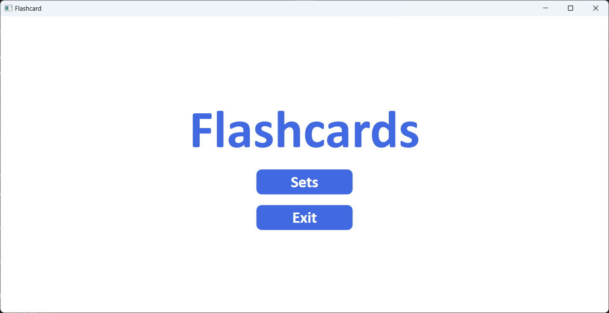
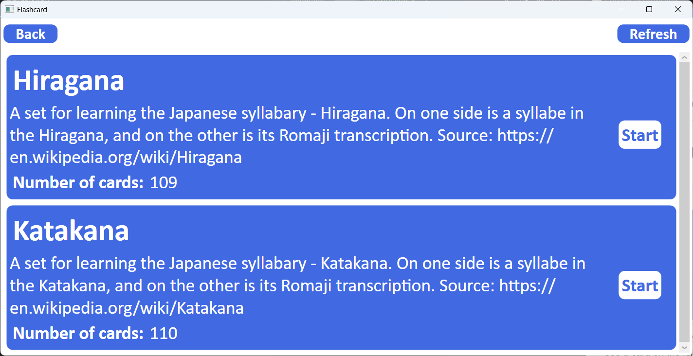
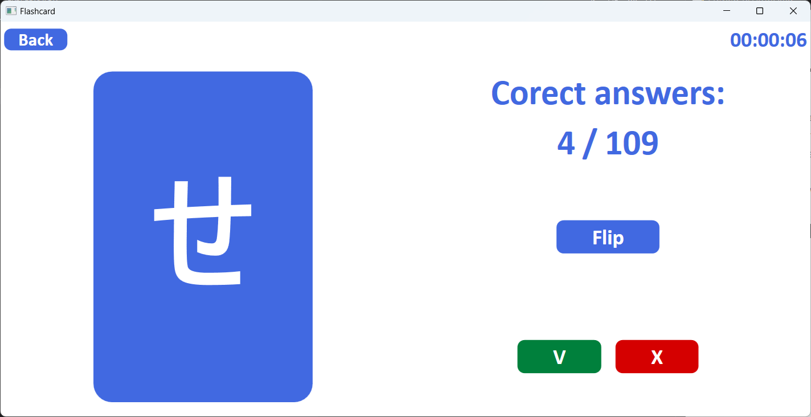
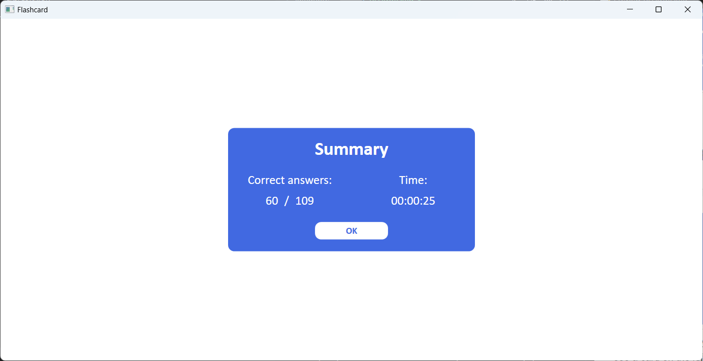

# Flashcards
The application is designed to make learning with flashcards easier. It allows you to display a set of flashcards and with their help test your knowledge or learn something through repeating. When the session is over, it displays information about how many cards you know and how long it took to learn.

## How it works

To see the list of available card sets, press the "Start" button. The "Exit" button closes the application.

The list includes all the sets that are in the "sets" folder. To start learning, press the "Start" button next to the selected set.

### Example: Japanese syllabary - Hiragana

When you start studying with the chosen set of cards you will see a card on the left and a panel with buttons on the other side. As an example, if you know what sign is on the card, you press the green button. If you don't know, you press the red button. If you are unsure, you can flip the card with the "Flip" button. The session will end after all cards have been viewed.

The summary includes the number of cards marked by the user as known and the duration of studying.

## How to add more flashcards

The program comes with two sets of cards - Hiragana and Katakana. The data is stored in json files in the "sets" folder. To add your own cards, you can copy one of the files and change its contents.

## How the application is designed

The application is designed following the MVVM design pattern using WPF.